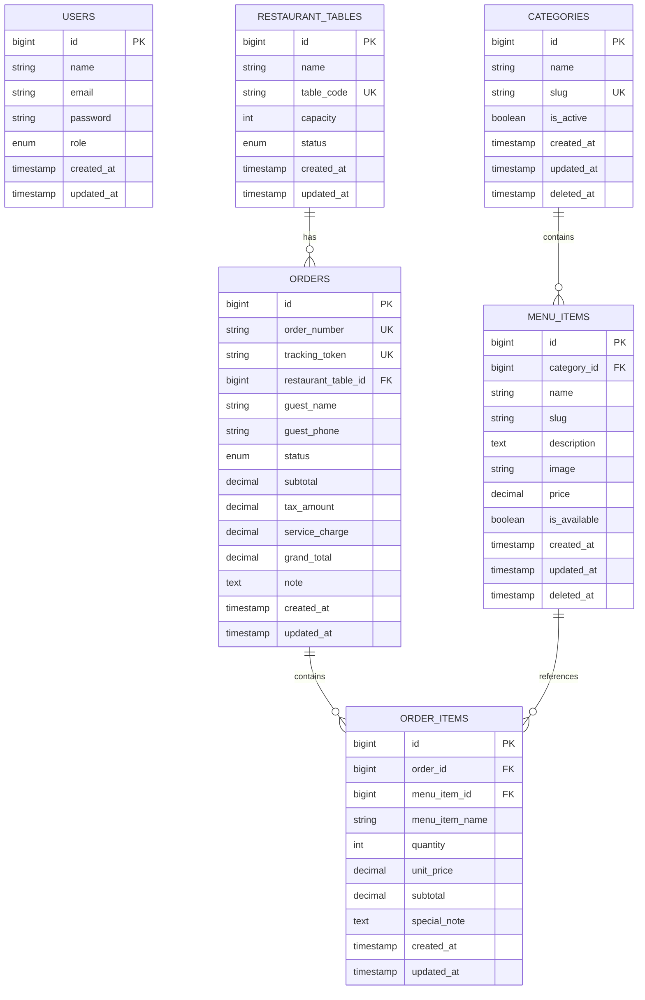

# Restaurant Management System — Backend

Laravel 12 REST API backend for the Restaurant Management System.

This backend provides authentication, restaurant table management, menu and category management, order processing, kitchen operations, dashboard statistics, and realtime broadcasting.

---

## Tech Stack

* Laravel 12
* PHP 8.2+
* MySQL
* Laravel Sanctum
* Laravel Reverb
* Laravel Queue
* Eloquent ORM
* RESTful API

---

## Features

### Authentication

* Admin login
* Staff login
* Laravel Sanctum API authentication
* Role-based authorization
* Admin / Staff permissions

### Restaurant

* Restaurant table management
* Unique table codes
* QR code generation
* Table status management

### Menu

* Category CRUD
* Menu item CRUD
* Menu image upload
* Availability management
* Menu filtering and search

### Orders

* Guest name optional
* Guest phone optional
* Multiple orders per table
* Order item snapshots
* Server-side price calculation
* Tax calculation: 5%
* Service charge: 10%
* Grand total calculation
* Order status workflow
* Permanent order number
* Tracking token

### Kitchen

* Kitchen Display System API
* Realtime order updates
* Realtime order status updates

### Dashboard

* Today's order count
* Today's sales
* Today's pending orders

---

# Requirements

Install the following before running the backend:

* PHP 8.2+
* Composer
* MySQL 8+
* Git

---

# Installation

## 1. Clone Repository

```bash
git clone https://github.com/YOUR_USERNAME/restaurant-management-backend.git
```

```bash
cd restaurant-management-backend
```

---

## 2. Install Dependencies

```bash
composer install
```

---

## 3. Create Environment File

### Windows

```bash
copy .env.example .env
```

### macOS / Linux

```bash
cp .env.example .env
```

---

## 4. Generate Application Key

```bash
php artisan key:generate
```

---

# Environment Configuration

Create `.env`:

```env
APP_NAME="Restaurant Management API"
APP_ENV=local
APP_KEY=
APP_DEBUG=true
APP_URL=http://localhost:8000

APP_LOCALE=en
APP_FALLBACK_LOCALE=en

LOG_CHANNEL=stack
LOG_LEVEL=debug

DB_CONNECTION=mysql
DB_HOST=127.0.0.1
DB_PORT=3306
DB_DATABASE=restaurant_management
DB_USERNAME=root
DB_PASSWORD=

BROADCAST_CONNECTION=reverb

REVERB_APP_ID=restaurant-management
REVERB_APP_KEY=restaurant-management-key
REVERB_APP_SECRET=restaurant-management-secret

REVERB_HOST=127.0.0.1
REVERB_PORT=8080

REVERB_SCHEME=http

QUEUE_CONNECTION=database

FILESYSTEM_DISK=public
```

Update the MySQL credentials according to your local environment.

---

# Database

Create a MySQL database:

```sql
CREATE DATABASE restaurant_management
CHARACTER SET utf8mb4
COLLATE utf8mb4_unicode_ci;
```

---

# Migration

Run database migrations:

```bash
php artisan migrate
```

Reset and rebuild the database:

```bash
php artisan migrate:fresh
```

---

# Seeder

Run seeders:

```bash
php artisan db:seed
```

Or:

```bash
php artisan migrate:fresh --seed
```

---

# Demo Credentials

The default demo administrator:

```text
Email: admin@gmail.com
Password: password
Role: admin
```

> Change the demo password before using the system in production.

---

# Storage

Create the public storage link:

```bash
php artisan storage:link
```

Menu images are stored in:

```text
storage/app/public/menu-items
```

---

# QR Code

QR code package:

```bash
composer require f9webltd/simple-qrcode
```

Generate the public storage link before testing QR functionality:

```bash
php artisan storage:link
```

Sample table code:

```text
TBL_DEMO01
```

Sample customer URL:

```text
http://localhost:5173/t/TBL_DEMO01
```

The sample table must exist in the database.

---

# API Base URL

```text
http://localhost:8000/api/v1
```

---

# API Endpoints

## Authentication

```text
POST /api/v1/auth/login
GET  /api/v1/auth/me
POST /api/v1/auth/logout
```

---

## Public Customer API

```text
GET  /api/v1/public/categories
GET  /api/v1/public/menu-items
GET  /api/v1/public/tables/{table_code}

POST /api/v1/public/orders
GET  /api/v1/public/orders/{order_number}
GET  /api/v1/public/orders/track/{tracking_token}
```

---

## Orders

```text
GET   /api/v1/orders
GET   /api/v1/orders/{order}
PATCH /api/v1/orders/{order}/status
```

---

## Menu

```text
GET    /api/v1/menu-items
POST   /api/v1/menu-items
GET    /api/v1/menu-items/{menu_item}
PUT    /api/v1/menu-items/{menu_item}
DELETE /api/v1/menu-items/{menu_item}
```

---

## Categories

```text
GET    /api/v1/categories
POST   /api/v1/categories
GET    /api/v1/categories/{category}
PUT    /api/v1/categories/{category}
DELETE /api/v1/categories/{category}
```

---

## Tables

```text
GET    /api/v1/tables
POST   /api/v1/tables
GET    /api/v1/tables/{table}
PUT    /api/v1/tables/{table}
DELETE /api/v1/tables/{table}
GET    /api/v1/tables/{restaurant_table}/qr
```

---

## Dashboard

```text
GET /api/v1/dashboard
```

---

# Authentication

Laravel Sanctum is used for API authentication.

Authenticated requests must include:

```http
Authorization: Bearer TOKEN
Accept: application/json
```

---

# Roles

## Admin

Admin can manage:

* Dashboard
* Orders
* Kitchen
* Categories
* Menu
* Tables
* QR Codes

## Staff

Staff can manage:

* Orders
* Kitchen

Staff can view menu/category data but cannot modify menu or restaurant settings.

---

# Order Calculation

Order prices are always calculated on the backend.

Frontend-submitted prices are not trusted.

```text
Subtotal
    +
Tax (5%)
    +
Service Charge (10%)
    =
Grand Total
```

Example:

```text
Subtotal                20,000 MMK
Tax (5%)                 1,000 MMK
Service Charge (10%)     2,000 MMK
-----------------------------------
Grand Total             23,000 MMK
```

---

# Order Status

```text
pending
   ↓
confirmed
   ↓
preparing
   ↓
ready
   ↓
served
   ↓
completed
```

Cancellation is allowed from the appropriate active states.

Final states:

```text
completed
cancelled
```

---

# Realtime Broadcasting

Realtime uses:

* Laravel Reverb
* Laravel Echo
* Pusher protocol
* Laravel Queue

Channels:

```text
private-restaurant.orders
private-kitchen.orders
orders.{tracking_token}
```

Events:

```text
order.created
order.status.updated
```

---

# Running the Backend

Use three terminal windows.

### Laravel

```bash
php artisan serve
```

### Queue Worker

```bash
php artisan queue:work
```

### Reverb

```bash
php artisan reverb:start
```

Backend:

```text
http://localhost:8000
```

Reverb:

```text
ws://localhost:8080
```

---

# Clear Cache

After changing `.env`:

```bash
php artisan optimize:clear
```

---

# Database Schema



---

# Architecture Decisions

## REST API

The backend is implemented as a REST API under:

```text
/api/v1
```

The frontend is completely separated from Laravel.

---

## SPA Architecture

The backend does not render the main application UI.

Vue 3 handles:

* Admin UI
* Customer UI
* Navigation
* Cart state
* Realtime UI
* Form interaction

Laravel handles:

* Authentication
* Authorization
* Business logic
* Database
* Order calculation
* File storage
* Realtime broadcasting

---

## Why REST API?

A separate REST API allows the backend to be reused later by:

* Mobile applications
* POS applications
* Other web clients
* Third-party integrations

---

## Order Item Snapshot

The `order_items` table stores:

```text
menu_item_name
unit_price
subtotal
```

This preserves historical order information even when the menu item is edited or deleted.

---

# Development Commands

```bash
composer install
php artisan key:generate
php artisan migrate --seed
php artisan storage:link
php artisan optimize:clear
php artisan serve
php artisan queue:work
php artisan reverb:start
```

---

# License

For educational and Junior Interview.
